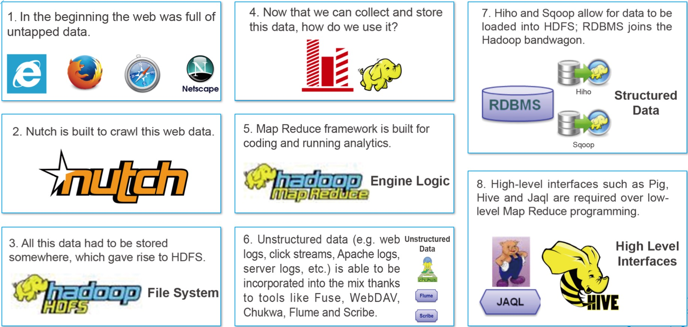
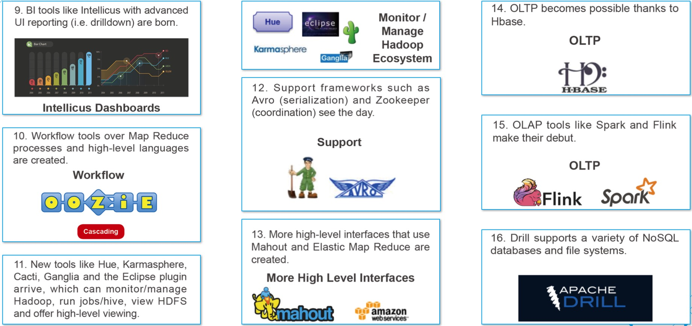
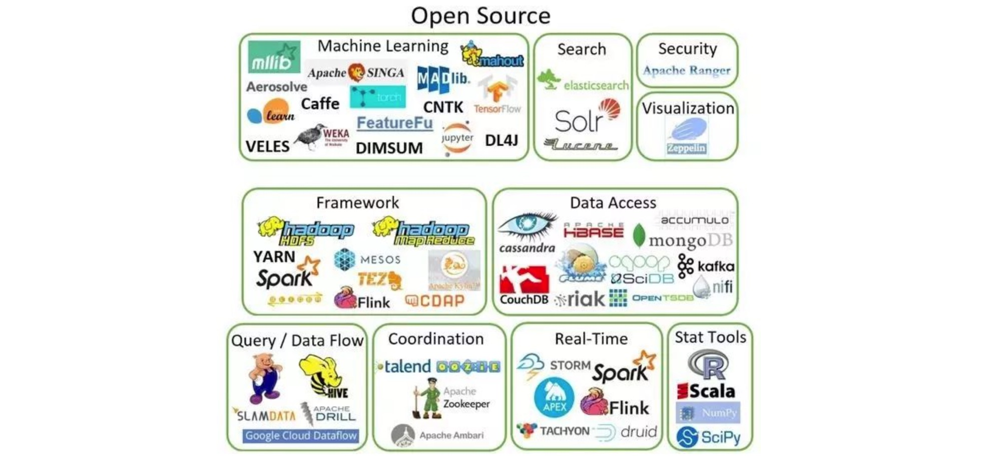

# 大数据与人工智能
**[小象学院](http://www.chinahadoop.cn/course/landpage/15)《机器学习集训营》课程资料 by [@寒小阳](https://www.chinahadoop.cn/user/49339/about)**


## 大数据vs人工智能
> ### 人工智能需要有大数据支撑


人工智能主要有三个分支：

- 1.基于规则的人工智能；
- 2.无规则，计算机读取大量数据，根据数据的统计、概率分析等方法，进行智能处理的人工智能；
- 3.基于神经网络的深度学习。

基于规则的人工智能，在计算机内根据规定的语法结构录入规则，用这些规则进行智能处理，缺乏灵活性，不适合实用化。因此，人工智能实际上的主流分支是后两者。

而后两者都是通过“计算机读取大量数据，提升人工智能本身的能力/精准度”。如今，大量数据产生之后，有低成本的存储器将其存储，有高速的CPU对其进  行处理，所以才有了人工智能后两个分支的理论得以实践。由此，人工智能就能做出接近人类的处理或者判断，提升精准度。同时，采用人工智能的服务作为高附加  值服务，成为了获取更多用户的主要因素，而不断增加的用户，产生更多的数据，使得人工智能进一步优化。

> ### 大数据的理解与挖掘需要人工智能

大数据分为“结构化数据”与“非结构化数据”。

“结构化数据”是指企业的客户信息、经营数据、销售数据、库存数据等，存储于普通的数据库之中，专指可作为数据库进行管理的数据。相反，“非结构化数据”是指不存储于数据库之中的，包括电子邮件、文本文件、图像、视频等数据。

目前，非结构化数据激增，企业数据的80％左右都是非结构化数据。随着社交媒体的兴起，非结构化数据更是迎来了爆发式增长。复杂、海量的数据通常被称为大数据。

但是，这些大数据的分析并不简单。文本挖掘需要“自然语言处理”技术，图像与视频解析需要“图像解析技术”。如今，“语音识别技术”也不可或缺。这些都是传统意义上人工智能领域所研究的技术。

现代的人工智能进化，不仅需要理论研究，还需要大量的数据作为原料。

## 大数据发展史

### 发展历程



### 大数据开源生态圈


### 大数据发展故事
#### 从Google的大数据三驾马车谈起

Google在2003年到2004年先后发布了被称为大数据三驾马车的三篇重要论文，分别是分布式数据处理MapReduce、分布式数据存储GFS以及列式存储 数据库BigTable。正是谷歌的这三驾马车掀开了大数据时代的序幕，谷歌也毋庸置疑的成为了当代大数据技术的始祖，可以说现今几乎所有的大数据技术都是由这三种技术发展而来的。

谷歌的这三驾马车之所以能够奠定大数据技术的基础，是因为这三种技术涵盖了大数据技术所需要的海量存储、海量数据库、分布式计算这三个最基本的需求。
大数据之所以能被称为大数据，就是因为要处理的数据量比一般情况下大得多，大到单独一台机器远远无法承担。
为了处理更大量的数据，传统的解决办法是升级机器，配上更大的磁盘容量，更多核数的CPU，更大的内存，来存储和处理更多的数据，这种做法叫做纵向扩展。这种做法简单直接，但是成本高昂。更麻烦的是，单台机器的性能是有极限的，对于现在动不动就要上PB的数据规模来说，再高的配置也远远不够。更不用说，单台机器还存在机器故障后数据丢失的风险，数据的可靠性难以保证。
谷歌的三驾马车则为大数据问题提供了更优的解决思路，那就是增多机器数而非提升机器性能，即横向扩展。按照这种思路，可以使用大量的廉价通用服务器构建一个巨大的集群，对海量的数据进行分布式的存储和处理。俗话说，三个臭皮匠顶上诸葛亮，100台廉价服务器加在一起的性能是要远高于单独一台顶配服务器的。因此利用谷歌的这种思路，你就能通过堆机器这种方法以相对低的成本获得以往无法想象的数据处理性能。

谷歌的这三驾马车虽然牛逼，但是一直以来都只作为谷歌的内部技术被使用，并没有向业界开源，因此真正熟知并理解这三种技术的人其实并不多。真正被世人熟知的大数据技术始祖其实是Hadoop，这个后人借助谷歌三驾马车思想而构建的开源大数据套件。

#### 大数据存储之Hadoop HDFS

大数据处理的第一步自然是要先找到一个存放数据的地方。HDFS提供的便是海量文件的存储技术。
HDFS是谷歌GFS技术的开源实现版本。HDFS将文件分成块分布到不同的机器上，从而借助成千上万台廉价PC实现海量数据的高可靠性存储。
在HDFS中，一份文件会拥有多份分布在不同机器上的复制，因此即使某台机器坏了数据也不会丢失，具备极高的可靠性。
尽管HDFS使用了很多复杂的分布式存储技术，但是对用户来说，使用HDFS和使用以往的文件系统一样简单。用户不用关心文件是如何分块的或者文件存储在集群的哪个节点上这种问题，只需要连上HDFS，之后像使用Linux本地文件系统一样使用HDFS即可。

#### 大数据计算之Hadoop MapReduce

数据有地方存了，接下来要做的当然是对数据进行分析了。
Hadoop MapReduce和Google的MapReduce一样，提供海量数据的分布式处理能力。通过MapReuduce，成百上千台机器可以共同协作去计算同一个问题，从而依靠大量机器的共同力量去解决海量数据的计算问题。
MapReduce通过Map和Reduce两个主要阶段。在Map阶段，MapReuce把数据划分成很多个部分读入，然后将数据解析成方便计算和key-value形式。在Reduce阶段，数据按照key的不同被再次划分到不同的机器，然后每台机器格子对数据进行聚合计算，最终形成用户期望的计算结果。下边一张图可以让你对MapReduce的过程有一个更形象的认识：


MapReduce过程

MapReduce实际的计算流程要比上边描述的复杂的多，而你只要记住，MapReduce解决的本质问题就是如何将数据合理的分布到很多台机器上进行计算，以及如何合理的合并多台机器上的计算结果。

#### Pig

通过编写MapReduce脚本已经可以借助大数据手段解决几乎所有的海量数据的计算和分析问题。但是，MapReduce存在一个严重的问题，那就是MapReduce脚本编写起来实在是太费劲了！想编写MapReuce程序，你首先需要弄懂MapReduce的原理，合理的把计算过程拆分成Map和Reduce两步，然后你还需要正确的配置一大堆MapReduce的执行参数，之后提交任务，反复检查运行状态，检查运行结果，这时候如果你的MapReduce脚本存在问题，那么你还需要去翻log分析问题出在哪里，然后修改你的脚本再来一遍。因此，想写出一个能用的MapReduce程序不但有较高的难度，还需要耗费大量的时间和精力。

那么，如果我很懒，实在不想去写复杂的MapReduce程序，那么有没有什么办法能够简化写MapReduce的这个繁杂的过程呢？当然有，那就是Pig了（此时你一定明白Pig这个名称的由来了，就是为懒人服务的工具）。Pig的意义就是替你编写复杂的MapReduce脚本，从而简化MapReduce的开发流程，大大缩短开发周期。
Pig实现了一种叫做Pig Latin的语言，你只需要编写简单的几行Latin代码，就可以实现在MapReduce需要大量代码才能实现的功能。Pig帮你预设了多种数据结构，从而帮助你方便的将输入文本中的内容转换为Pig中结构化数据。Pig还提供了诸如filter、group by、max、min等常用的计算方法，帮助你快速实现一些常规的数据计算。执行和查看结果在Pig中也非常的简单，你不再需要配置MapReduce中的一大堆复杂的参数，也不再需要手动到HDFS上下载运行结果并对下载结果进行排版，Pig会直接把运行结果用良好的排版展示给你看，就像在SQL数据库中一样方便。

有了Pig，不用写MapReduce了，数据开发也快多了。但是Pig仍然存在一些局限，因为使用Pig从本质上来说还相当于用MapReduce，只是脚本的编写比以前快了，但是你仍然要一行一行的去写Pig脚本，从而一步一步的实现你的数据分析过程。此时如果有工程师说自己已经懒得无可救药了，连Pig脚本也不想写；或者有数据分析师说自己不懂技术，压根不会写脚本，只会写几句简单的SQL，那么有没有什么比Pig还简单的办法呢？那么下边就该Hive出场了！

#### Hive

Hive是一种数据仓库软件，可以在分布式存储系统的基础之上（例如HDFS）构建支持SQL的海量数据存储数据库。
简单的说，Hive的作用就是把SQL转换为MapReduce任务进行执行，拿到结果后展示给用户。如此一来，你就可以使用普通的SQL去查询分布在分布式系统上的海量数据。
尽管Hive能提供和普通SQL数据库一样好用的SQL语句，但是Hive的查询时延是要远高于普通数据库的，毕竟查询时间和数据规模二者还是不能兼得的啊！由于Hive并且每次查询都需要运行一个复杂的MapReduce任务，因此Hive SQL的查询延时是远高于普通SQL的。与此同时，对于传统数据库必备的行更新、事务、索引这一类“精细化”操作，大条的Hive自然也都不支持。毕竟Hive的诞生就是为了处理海量数据，用Hive处理小数据无异于杀鸡用牛刀，自然是无法得到理想的效果，因此，Hive只适合海量数据的SQL查询。

#### Spark

有了Hive，不会编程的你也能用SQL分析大数据了，世界似乎已经美好了很多。可惜好戏不长，慢慢的，你还发现Hive依旧有一堆的问题，最典型的问题就是查询时延太长（这里特指MapReduce Hive，而非Spark Hive）。受限于MapReduce任务的执行时间，查一次Hive快则几十分钟，慢则几小时都是有可能的。试想领导着急的问你还要报表，而你只能无奈的等待缓慢的Hive查询运行完，此时的你一定急的想砸显示屏了。那么有没有什么既好用，又执行迅速的大数据工具呢？下边就该我们的新星级产品Spark登场了。

与MapReduce类似，Spark同样是分布式计算引擎，只是Spark的诞生要比MapReduce晚一些，但是Spark后来者居上，如今在很多领域都大有取代MapReduce的趋势。

Spark相较于MapReduce最大的特点就是内存计算和对DAG模型的良好支持，借助这些特点，对于计算任务，尤其是需要分很多个阶段进行的复杂计算任务，Spark的执行速度要远远快于MapReeduce。
在MapReduce执行过程中，需要将中间数据先写入到磁盘中，然后再加载到各个节点上进行计算，受限于巨大的磁盘IO开销，MapReduce的执行经常要很长时间。而Spark则是将中间数据加载在内存中，因此能取得远高于MapReduce的执行速度。

Spark的优点还远不止此。相较MapReduce，Spark提供了很多高层次封装的功能，在易用性上和功能丰富程度上都要远远高于MapReduce。用Spark你甚至只需要一行代码就能实现group、sort等多种计算过程。这点上Spark可以说是同时融合了Pig和Hive的特点，能够用简单几行代码实现以往MapReduce需要大量代码才能实现的功能。下边来一行Spark代码让大家感受下：

```
val wordCounts = textFile.flatMap(line => line.split(" ")).groupByKey(identity).count()
```

以上代码实现Word Count。
除此之外，Spark还支持Python、Scala、Java三种开发语言，对于Python和Scala甚至还提供了交互式操作功能，对于非Java开发者以及科研工作者真是友好到爆，事实上Spark确实也广受科研工作者的欢迎。
新版本的Spark还提供了Spark SQL、Spark streaming（后边会介绍）等高层次的功能，前者提供类似Hive的SQL查询，后者提供强大的实时计算功能（后边会详细介绍），大有一统大数据分析领域的趋势。因此Spark绝对是当今发展势头最好的大数据组件之一。

不过Spark也并非真的就无敌了，内存计算的特点还是会对Spark能够应对的数据规模产生影响。另外，对于计算过程的控制和调优，Spark也不如MapReduce灵活。

#### Storm

有了前边讲的这一系列工具，我们已经能够对海量数据进行方便的计算分析了。但是前边的这些工具，从基础的MapReduce到简单易用的Hive，都依然存在一个问题，那就是计算过程需要较长的时间。也就是说，从你开始执行数据分析任务，到MapReduce生成你要的结果，常常需要若干小时的时间。由于这个延时的存在，MapReduce得到的数据分析结果是要比线上业务慢半拍的，例如今天得到昨天的日志分析结果，也因此，MapReduce又被称作离线数据处理或者批处理。
但是，如果你希望能够立刻得到数据的分析结果，例如像天猫双十一实时大屏那样实时的显示最新的成交额，那么你就需要一些实时数据处理工具了。

最新火起来的实时数据处理工具要当属Apache Storm了。我们直到在MapReduce这类离线处理工具中，数据是要一批一批的被处理的，并且每批数据都需要一定的处理时延。而在Storm中，是没有批这个概念的，在Storm中数据就如同水龙头中的水一样源源不断地流出，并被实时的进行处理。因此，在Storm中，只要你搭建好了数据处理流程，数据就会源源不断的，永不停止的被接受并处理，并且你可以随时看到数据的最新处理结果。


Storm

尽管Storm和MapReduce的处理流程差异很大，但是它们的基本思路是一致的，都是把数据按照key分散到不同的机器上，之后由各个机器对数据进行处理，最终将各个机器的计算结果汇总在一起。
不同的是，Storm中的数据处理是一条一条实时进行的，因此结果会处于一种不断的刷新过程中；而MapReduce是一次性处理完所有输入数据并得到最终结果，因此你将会直接看到最终结果。
例如，假设有大量的文章需要统计单词的出现次数，对于MapReduce，你将直接看到最终结果：hello: 3, world: 2, you: 6；而对于Storm，你将会看到hello:1, world:1, you: 1, world: 2, you:2……这样的处于不断刷新中的统计结果。

另外值得一提的是，Storm和MapReduce也并不是一个互相取代的关系，而是一个互补的关系。Storm可是让你实时的得到数据的最新统计状态，但是在数据吞吐量方面是要低于MapReduce的，并且对于相同的数据量，如果只关注最终结果，MapReuce得到最终结果所需的时间和资源肯定是要小于Storm的。因此，如果你需要实时的查看数据的最新统计状态，用Storm；如果你只关注数据的最终统计结果，用MapReduce。

#### Flink和Spark Streaming

谈完Storm，就必须顺带也谈一下另外两种同样火爆的实时数据处理工具，那就是Flink和Spark Straming。这两种技术要晚于storm诞生，但是现在大有后来者居上的趋势。

Flink与Storm非常类似，都能够提供实时数据流处理功能。区别在于Flink还能够支持一些更高层的功能，例如group by这种常用算法。另外，Flink还具备比Storm更高的吞吐量和更低的延时，这是因为Flink在处理完一条条数据的时候是分组批量确认的，而Storm则是一条一条确认。Flink的这种特性带来了很大的性能优势，但是也会对单条数据的处理时延带来很大的不稳定因素，因为任何相邻数据的处理失败都会导致整组数据被重新处理，从而严重影响一组数据的处理时延。因此，如果你追求更高的吞吐量，可以选择Flink，如果你对每条数据的处理时延都有极高的要求，那么选Storm。

至于Spark Streaming，其实并不能算得上是纯正的实时数据处理，因为Spark Streaming在处理流数据时依然用的是批处理的模式，即凑齐一批数据后启动一个Spark任务得到处理结果。你甚至可以把Spark Streaming简单看成是带流输入的Spark。得益于Spark任务执行快速的优点，尽管Spark Streaming是一种伪实时处理系统，但是依然能得到还不错的实时性（秒级），当然要跟Storm比的话实时性还是差不少的，但是Spark在吞吐量方面要强于Storm。

Spark Streaming和Flink除了吞吐量这个优点外，还有另一个重要的优点，那就是能够同时支持批处理和实时数据处理。也就是说，你只需要一套系统就能够同时分析你的实时数据和离线数据，这对于架构精简（tōu lǎn）来说是大有好处的。

## 课程学习指南

本课程核心覆盖数据批处理的技能，也是大家在**机器学习/深度学习**的数据处理中需要频繁使用到的技能，包括Hadoop和Spark相关知识。

- Hadoop部分：大家需要重点掌握**HDFS的相关知识和操作命令、Hadoop Map-Reduce计算模型的核心思想**(hadoop streaming方式编写代码大家理解即可，现在spark的API方式编写代码会比这个方式简洁很多)
- Spark部分：大家需要重点掌握**Spark的RDD核心transformation和actions，基于DataFrame的操作，Spark SQL数据处理**
